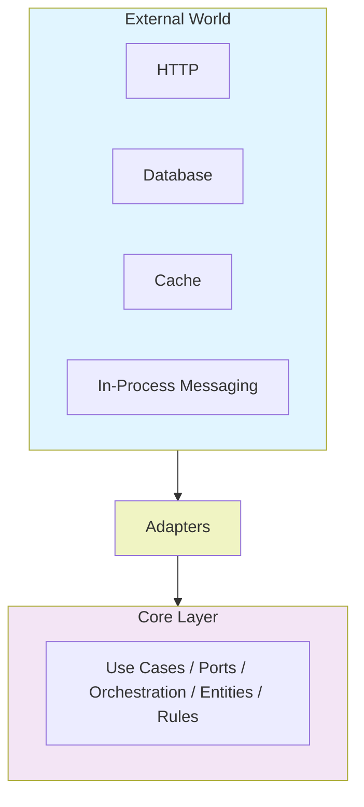
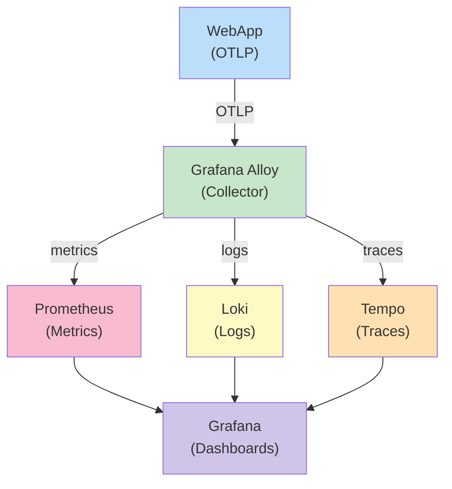

# 🏗️ Hexagonal Architecture Solution Template

A production-ready .NET template for building services following [Hexagonal Architecture](https://alistair.cockburn.us/hexagonal-architecture/) (also known as Ports and Adapters). It ships with Domain-Driven Design (DDD) patterns, CQRS-style use cases, full observability, and a complete multi-layer testing strategy out of the box.

---

## 📑 Table of Contents

1. [Project Overview](#-project-overview)
2. [Project Structure](#-project-structure)
3. [Getting Started](#-getting-started)
4. [Running the App](#-running-the-app)
5. [Testing Strategy](#-testing-strategy)
6. [Development Workflow](#-development-workflow)
7. [Helper Commands](#-helper-commands)
9. [Docker Setup](#-docker-setup)
10. [Monitoring & Telemetry](#-monitoring--telemetry)
11. [Contributing](#-contributing)

---

## 🌐 Project Overview

### What is Hexagonal Architecture?

Hexagonal Architecture isolates the core business logic from external concerns (databases, HTTP, messaging, caches) by defining explicit **ports** (interfaces) and **adapters** (implementations).



### Key Design Decisions

| Concern | Approach |
|---|---|
| Business rules & domain | Encapsulated in aggregates and entities inside `Core` |
| Orchestration | Single-responsibility `UseCase` classes in `Core` |
| Persistence | Repository pattern with EF Core (PostgreSQL) |
| Caching | Hybrid cache (Redis + in-memory) via `IHybridCacheService` |
| Messaging | In-process `System.Threading.Channels` producers/consumers |
| UI surface | Blazor Server (interactive, SignalR-based) |
| Observability | OpenTelemetry → Grafana / Loki / Tempo / Prometheus |
| Validation | DataAnnotations, validated automatically at the use case boundary |

---

## 📁 Project Structure

```
.
├── src/
│   ├── Core/                   # Domain entities, use cases, ports (interfaces), DTOs
│   ├── Infrastructure/         # Adapters: EF Core, Redis, in-process messaging, OpenTelemetry
│   └── WebUi/                  # Entry point: Blazor Server pages and components
├── tests/
│   ├── CommonTests/            # Shared test utilities and base fixtures
│   ├── UnitTests/              # Isolated unit + architecture tests
│   ├── IntegrationTests/       # End-to-end slice tests with real infra
│   └── E2eTests/               # Playwright-based browser tests against a running app
└── scripts/
    ├── sql/                    # Migrations & seed SQL run by Docker
    └── grafana/                # Alloy, Loki, Prometheus, Tempo configs
```

### `src/Core/`

The innermost layer. Contains both domain logic and use case orchestration. Has **zero dependencies** on Infrastructure or WebUi.

```
Core/
├── Common/
│   ├── DomainEntity.cs         # Base class for all entities (Id, audit fields, soft-delete)
│   ├── Result.cs               # Railway-oriented Result<T> type for domain outcomes
│   ├── DefaultConfigurations.cs# App name, ActivitySource, Meter
│   ├── Attributes/             # Custom validation attributes (e.g. [NotDefault])
│   ├── Enums/                  # Domain-scoped enumerations
│   ├── Exceptions/             # Domain-specific exceptions
│   ├── Extensions/             # Pure domain extension methods
│   ├── Helpers/                # Structured logging helpers
│   ├── Messages/               # In-process message contracts (BaseMessage)
│   ├── Repositories/           # IBaseRepository port interface
│   ├── Requests/               # BaseRequest, BaseResponse, BasePaginatedRequest/Response
│   ├── Services/               # IHybridCacheService, IProduceService port interfaces
│   └── UseCases/               # BaseUseCase, BaseInOutUseCase, BaseInUseCase, BaseOutUseCase
├── Orders/                     # Orders aggregate + use cases + DTO
└── Notifications/              # Notifications aggregate + use cases + DTO
```

> **Design note:** All business invariants are enforced inside domain entities. Entity creation/mutations return `Result<T>` — always check `IsFailure` before using `.Value`.

### `src/Infrastructure/`

Contains all **adapter implementations**. Depends only on Core.

```
Infrastructure/
├── Data/
│   ├── MyDbContext.cs          # EF Core DbContext
│   ├── MyDbContextFactory.cs   # Design-time factory for EF CLI
│   ├── Migrations/             # EF Core migrations
│   ├── Mapping/                # Fluent API entity configurations
│   └── Common/
│       └── BaseRepository.cs   # IBaseRepository implementation
├── Cache/
│   └── Services/
│       └── HybridCacheService.cs   # IHybridCacheService implementation (Redis + IMemoryCache)
├── Messaging/
│   ├── Producers/
│   │   └── ProducerService.cs  # IProduceService — writes to Channel<TMessage>
│   └── Consumers/
│       ├── BaseConsumer.cs     # BackgroundService reading from Channel<TMessage>, idempotent
│       └── CreateNotificationConsumer.cs
├── Common/
│   ├── BaseBackgroundService.cs
│   └── BaseBackgroundChannelService.cs
└── OpenTelemetry/              # Tracing, metrics, logging wiring (OTLP)
```

### `src/WebUi/`

The outermost adapter layer. Composes everything together and serves the Blazor Server UI.

```
WebUi/
├── Program.cs                  # DI registration & middleware pipeline
├── Pages/
│   ├── Orders/                 # OrderList, OrderDetail, CreateOrder, EditOrder Blazor pages
│   └── Common/                 # Shared components (DeleteConfirmDialog, etc.)
├── Middlewares/
│   └── ExceptionHandlingMiddleware.cs
└── Extensions/
    └── HealthCheckExtensions.cs
```

---

## 🚀 Getting Started

### Prerequisites

| Tool | Minimum Version | Notes |
|---|---|---|
| [.NET SDK](https://dotnet.microsoft.com/download) | 10.0 | `dotnet --version` |
| [Docker Desktop](https://www.docker.com/products/docker-desktop) | 4.x | For all backing services |
| [EF Core CLI](https://learn.microsoft.com/en-us/ef/core/cli/dotnet) | latest | `dotnet tool install --global dotnet-ef` |
| [Stryker.NET](https://stryker-mutator.io/docs/stryker-net/getting-started/) | latest | `dotnet tool install --global dotnet-stryker` |

### Installation

```bash
# 1. Restore NuGet packages
dotnet restore

# 2. Start backing services (PostgreSQL, Redis, full observability stack)
docker compose -f docker-compose-local.yml up -d

# 3. Apply database migrations
dotnet ef database update --project src/Infrastructure --startup-project src/WebUi

# 4. Run the app
dotnet run --project src/WebUi
```

> ⚠️ **Note:** `docker-compose-local.yml` also starts **pgAdmin** on port `5050` (credentials: `admin@admin.com` / `admin`) and the full observability stack (Grafana, Prometheus, Loki, Tempo). The `postgres-init` container automatically runs `scripts/sql/migrations.sql` and `scripts/sql/seeds.sql` on first start.

---

## ▶️ Running the App

```bash
dotnet run --project src/WebUi
```

By default the app listens on:
- **Web UI:** `http://localhost:5015`
- **Health check:** `/health`

---

## 🧪 Testing Strategy

### Test Projects

| Project | Purpose | Runner |
|---|---|---|
| `CommonTests` | Shared fixtures, `BaseFixture`, and CSS selector constants | — (library) |
| `UnitTests` | Domain logic, use case orchestration, component tests, architecture rules | `dotnet test` |
| `IntegrationTests` | Full slice tests against a real DB | `dotnet test` |
| `E2eTests` | Browser-based tests via Playwright against a running app | `dotnet test` |

### Unit Tests (`tests/UnitTests/`)

```
UnitTests/
├── Core/
│   ├── Common/                 # DomainEntity tests, mock extensions
│   ├── Orders/                 # CreateOrderUseCaseTests, GetOrderUseCaseTests, …
│   └── Notifications/          # CreateNotificationUseCaseTests, …
├── WebUi/                      # Blazor component tests (bUnit)
└── Architecture/               # Layer dependency and naming convention enforcement
```

**Naming convention:** `GivenContext_WhenCondition_ThenExpectedResult`

```csharp
[Fact(DisplayName = nameof(GivenAValidRequestThenPass))]
public async Task GivenAValidRequestThenPass() { ... }
```

```bash
# All unit tests
dotnet test tests/UnitTests

# Single test class
dotnet test tests/UnitTests --filter "FullyQualifiedName~CreateOrderUseCaseTest"
```

### Integration Tests (`tests/IntegrationTests/`)

Spin up a real WebUi using `CustomWebApplicationFactory<Program>` against a local PostgreSQL instance (`Host=127.0.0.1;Port=5432;Database=OrderDb`).

```bash
dotnet test tests/IntegrationTests
```

### Mutation Tests (Stryker.NET)

Thresholds: **high ≥ 90%, low ≥ 80%, break < 50%**.

```bash
cd tests/UnitTests
dotnet stryker --config-file stryker-config-core.json
```

HTML reports are written to `tests/UnitTests/StrykerOutput/`.

### Run All Tests

```bash
dotnet test
```

---

## 🔧 Development Workflow

### Adding a New Feature (e.g., `Products`)

Follow the dependency direction: **Core → Infrastructure → WebApp**.

**1. Core — define the entity and use cases**
```
src/Core/Products/Product.cs                  # Entity with invariants
src/Core/Products/CreateProductUseCase.cs
src/Core/Products/GetProductUseCase.cs
src/Core/Products/ProductDto.cs
```

Use cases extending `BaseInOutUseCase` are **auto-registered** by `CoreDependencyInjection.AddCore()` — no manual DI wiring needed.

**2. Infrastructure — add persistence mapping**
```
src/Infrastructure/Data/Mapping/ProductDbMapping.cs   # EF Core fluent config
```

Create and apply the migration:
```bash
dotnet ef migrations add AddProduct --project src/Infrastructure --startup-project src/WebUi --output-dir Data/Migrations

dotnet ef database update --project src/Infrastructure --startup-project src/WebUi
```

**3. WebUi — add Blazor pages**
```
src/WebUi/Pages/Products/ProductList.razor
src/WebUi/Pages/Products/ProductList.razor.cs
```

**4. Tests — cover every layer**
```
tests/UnitTests/Core/Products/
tests/UnitTests/WebUi/
tests/E2eTests/WebUi/
```

> ✅ Architecture tests in `tests/UnitTests/Architecture/` automatically enforce that new code respects the dependency rules and naming conventions.

---

## 🛠️ Helper Commands

### Database Migrations

```bash
# Apply pending migrations
dotnet ef database update \
  --project src/Infrastructure \
  --startup-project src/WebUi

# Create a new migration
dotnet ef migrations add <MigrationName> \
  --project src/Infrastructure \
  --startup-project src/WebUi \
  --output-dir Data/Migrations

# Generate idempotent SQL script (for CI/CD deployments)
dotnet ef migrations script --idempotent \
  --project src/Infrastructure \
  --startup-project src/WebUi \
  --output scripts/sql/migrations.sql
```

### Running Tests

```bash
# All tests
dotnet test

# Unit tests only
dotnet test tests/UnitTests

# Integration tests only
dotnet test tests/IntegrationTests

# With coverage report
dotnet test --collect:"XPlat Code Coverage"
```

### Mutation Tests

```bash
cd tests/UnitTests
dotnet stryker --config-file stryker-config-core.json
```

---

## 🐳 Docker Setup

### `docker-compose-local.yml` — Development environment

Starts all backing services for local development, including the full observability stack:

| Service | Port(s) | Purpose |
|---|---|---|
| PostgreSQL 17 | `5432` | Primary database |
| pgAdmin | `5050` | Database GUI (`admin@admin.com` / `admin`) |
| Grafana Alloy | `4317`, `4318` | Telemetry collector (OTLP) |
| Prometheus | `9090` | Metrics |
| Loki | `3100` | Log aggregation |
| Grafana | `3000` | Dashboards |
| Tempo | `3200` | Distributed tracing |

```bash
docker compose -f docker-compose-local.yml up -d

# Tear down (keeps volumes)
docker compose -f docker-compose-local.yml down

# Tear down including volumes
docker compose -f docker-compose-local.yml down -v
```

### `docker-compose.yml` — Minimal environment (no observability)

Starts only PostgreSQL, Redis, and pgAdmin — useful when you don't need the monitoring stack.

```bash
docker compose up -d
```

### Build & run the app in Docker

```bash
docker build -t hexagonal-template .
docker run -p 5015:5015 hexagonal-template
```

---

## 📊 Monitoring & Telemetry

The template uses **OpenTelemetry** with OTLP exporters, collected and routed by **Grafana Alloy**.



### Accessing the dashboards

```bash
docker compose -f docker-compose-local.yml up -d
dotnet run --project src/WebUi
```

| Dashboard | URL | Credentials |
|---|---|---|
| Grafana | <http://localhost:3000> | anonymous (admin role) |
| Prometheus | <http://localhost:9090> | — |
| pgAdmin | <http://localhost:5050> | `admin@admin.com` / `admin` |

### Configuration files

| File | Purpose |
|---|---|
| `scripts/grafana/config.alloy` | Grafana Alloy pipeline (scrape → export) |
| `scripts/grafana/datasources.yaml` | Pre-provisioned Grafana data sources |
| `scripts/grafana/prometheus.yml` | Prometheus scrape targets |
| `scripts/grafana/loki-config.yaml` | Loki storage configuration |
| `scripts/grafana/tempo.yaml` | Tempo trace storage configuration |

> ✅ **Tip:** Structured logs include a `CorrelationId` that can be used to pivot from a log entry directly to the trace in Tempo's Explore view in Grafana.

---

## 🤝 Contributing

### Guidelines

1. Follow the layer dependency rules enforced by the architecture tests.
2. Every new use case must have unit tests following the `GivenContext_WhenCondition_ThenExpectedResult` naming convention.
3. Run `dotnet test` and the Stryker config before opening a pull request.
4. Keep domain entities free from infrastructure concerns — no EF Core attributes on entities in `Core`.
5. Add new CSS selectors to `tests/CommonTests/WebUi/Selectors.cs` — never hardcode selector strings in test files.

Have a feature request or found a bug? We'd love to hear from you!

- [Report a Bug](https://github.com/gpreviatti/hexagonal-solution-template/issues/new?template=bug_report.md)
- [Request a Feature](https://github.com/gpreviatti/hexagonal-solution-template/issues/new?template=feature_request.md)
